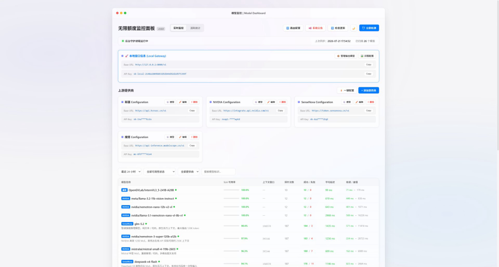

# 无限额度 · AI 模型网关 | Unlimited AI API Gateway

> 聚合多个免费 LLM 额度（NVIDIA / 商汤 / 魔搭 / Gemini 等），OpenAI 兼容接口，智能轮询自动切换，单渠道额度用完或故障**无感切换**，多个免费额度叠加 ≈ 无限额度体验。
>
> 🎁 桌面版下载 exe 双击即用，无需 Python 环境 · 自带实时监控面板 · 支持系统托盘后台常驻

⭐ **如果这个项目对你有帮助，欢迎点 Star 支持！你的 Star 是持续更新的动力。**

`openai兼容` `免费API` `无限额度` `LLM聚合` `API网关` `智能轮询` `熔断容灾` `负载均衡` `NVIDIA` `商汤` `魔搭` `Gemini` `API监控` `反代` `AI网关` `openai` `api-gateway` `llm` `free-api` `reverse-proxy`



---

## 📖 项目简介

本程序是一个**模型 API 网关**，可将多个上游 LLM 提供商（如 NVIDIA、商汤 SenseNova、魔搭 ModelScope 等）聚合为一个统一的 OpenAI 兼容接口。你在任何支持 OpenAI 格式的第三方工具（ChatBox、NextChat、SillyTavern、Dify 等）里填入本网关的地址和密钥，即可：

- 自动在多个上游渠道间**智能轮询**，单个渠道挂了无感切换
- 实时**监控**所有模型的健康状态、可用率、延迟
- 自定义**路由组**，按需调度模型
- 统计 **Token 消耗**

程序提供**桌面版（exe）**和**网页版（自行部署）**两种使用方式。

---

## 💡 为什么叫"无限额度"？

绝大多数主流 LLM 提供商都提供**免费额度**（如 NVIDIA 每月免费调用次数、魔搭、商汤、Gemini 等），但单个渠道的免费额度往往很快用完。

本网关的做法是：**把你所有的免费渠道聚合成一个 OpenAI 兼容入口**——

| 你的多个免费渠道 | 网关做的事 |
|------------------|-----------|
| NVIDIA 免费额度 | 自动轮询 |
| 商汤 SenseNova 免费额度 | 额度用完 → 无感切下一个 |
| 魔搭 ModelScope 免费额度 | 渠道故障 → 自动熔断跳过 |
| Gemini 免费额度 | 按可用率/延迟择优 |

**多个免费额度叠加 + 智能切换 = 你几乎永远有可用的免费模型**，这就是"无限额度"的来源。

> ⚠️ 前提：你需要自行注册各提供商账号并获取各自的免费 API Key，网关只负责聚合与调度，不提供密钥。

---

## ✨ 功能特性

### 📊 实时监控
- 展示所有上游模型健康状态、SLA 可用率、平均/极速/最慢延迟、探针次数
- 模型名旁的状态点代表**上次轮询**结果：🟢 正常 / 🔴 异常 / ⚪ 尚未巡检
- 智能轮询策略：每小时检测一次，非工作时间（21:00-次日7:00）不检测，累计检测超过20次后永久降为每天12:00检测一次，单模型月均约48次探测，对免费额度几乎无消耗
- 轮询策略可通过 `config.json` 自定义：`poll_interval`（间隔秒数）、`poll_work_start`/`poll_work_end`（工作时间）、`poll_daily_limit`（累计上限）
- 支持点击"立即检测"手动触发，手动检测会顺延自动轮询计时

### 📏 上下文长度
- 直接点击监控表格"上下文窗口"列的数字即可修改，回车保存

### 🔀 路由配置
- 创建自定义路由组并勾选成员模型，每个模型旁显示上下文长度
- 客户端 `model` 字段填路由组名即命中（如 `1m`、`256k`）
- 网关在组内按可用率/延迟加权择优
- 路由组创建后自动出现在"输出模型"列表

### ⚙️ 模型管理
- 每个提供商支持：编辑连接信息、勾选启用的模型、删除
- 添加提供商时自动从上游拉取可用模型列表
- 支持仅拉取免费模型

### 📦 管理输出模型
- 查看本网关对外暴露的所有模型 ID（格式 `提供商名-模型名`）
- 一键复制，方便填入第三方工具

### 📈 消耗统计
- 按近24小时 / 7 天 / 30 天统计请求数、输入/输出/合计 Token
- 按"渠道·模型"维度明细展示

### 🛡️ 智能容灾
- 熔断机制：某模型连续失败 3 次熔断 60 秒，恢复后自动重置计数
- 路由组按质量分 + 延迟加权排序候选，优先选高质量低延迟模型
- 流式转发中断时自动切换下一个候选模型继续输出，用户无感
- 路由组全失败自动重试一轮，两次均失败才返回错误
- 显式指定真实模型时直接透传上游，由上游决定成败

### 💾 系统托盘（后台常驻）
- 关闭窗口时程序**最小化到系统托盘**，监控/轮询/转发持续运行不中断
- 双击托盘图标或右键"显示窗口"即可恢复
- 右键托盘 → "退出" 才会真正关闭程序
- 图标纯代码生成，不依赖外部图片文件

### 🖼️ 识图辅助
- 内置 10 个视觉模型（NVIDIA/魔搭/商汤三大平台）
- 开启后自动识别图片并交给视觉模型回复，追问自动回退文本模型
- 一键配置自动加入识图路由组

### 🔄 在线更新
- 启动时自动检查新版本，有更新弹窗提醒
- 下载带进度条，完成后自动替换 exe 并重启
- 支持强制更新（可设最低版本号）

### 📢 系统公告
- 程序启动时自动弹出公告
- 公告内容变动后 60 秒内自动弹出，无需重启
- 支持 markdown 渲染

### 🌙 其他
- 深色 / 浅色模式切换（自动记忆），表单控件全适配
- 所有回复强制简体中文
- 质量统计采用滑动窗口，准确反映近期状态
- 打包精简至 43MB（从 124MB 缩减 65%）

---

## 🚀 使用方式

### 方式一：桌面版（推荐普通用户）

1. 下载 `网关客户端.exe`：可在 [Releases](https://github.com/zk-2025/model-gateway/releases) 或仓库 `dist/` 目录（Git LFS 管理）获取
2. 双击运行 → 首次显示免责声明 → 点"我已阅读并同意"
3. 自动打开程序窗口，首次会自动生成配置
4. 在"上游提供商"里点"+ 添加提供商"，填入你的 API 信息
5. 把程序显示的 **Base URL** 和 **API Key** 填入任何支持 OpenAI 格式的工具即可使用

> 桌面版无需安装 Python 环境，开箱即用。关闭窗口后程序会最小化到系统托盘后台运行，右键托盘"退出"可彻底关闭。程序同目录会自动生成配置文件。

### 方式二：网页版（自行部署）

适合想在服务器上部署、或本地有 Python 环境的用户。

#### 1. 克隆仓库
```bash
git clone https://github.com/zk-2025/model-gateway.git
cd model-gateway
```

#### 2. 安装依赖
```bash
pip install -r requirements.txt
```

#### 3a. 以桌面窗口模式运行（带原生窗口）
```bash
python app.py
```
会启动服务并弹出一个原生桌面窗口（需额外安装 `pip install pywebview`）。

#### 3b. 以纯网页模式运行（适合服务器）
```bash
python -m uvicorn app:app --host 0.0.0.0 --port 8000
```
然后在浏览器访问 `http://你的服务器IP:8000`。

> 服务器部署建议用 `uvicorn` 或 `gunicorn`，可配合 nginx 反向代理。网页版和桌面版功能完全一致，只是运行形态不同。

#### 4. 配置提供商
首次启动会自动生成 `config.json`（含本地密钥）。在管理面板的"上游提供商"里添加你的 API，或直接编辑 `providers.json`。

---

## ⚙️ 配置文件说明

| 文件 | 作用 | 说明 |
|------|------|------|
| `config.json` | 本地密钥与配置 | 首次启动自动生成，含 `local_api_key`、`port`、轮询配置等 |
| `providers.json` | 上游提供商 | 配置你的 API 渠道（名称、Base URL、API Key、模型列表） |
| `models_meta.json` | 模型元数据 | 模型别名、上下文长度、描述 |
| `routers.json` | 路由配置 | 自定义路由组（在面板里配置，自动生成） |
| `history.jsonl` | 巡检历史 | 自动保留 30 天 |
| `usage.jsonl` | 消耗统计 | 自动保留 30 天 |

可参考仓库里的 `config.example.json` 和 `providers.example.json`。

---

## 🔐 鉴权说明

### API Key 三种模式

| 模式 | 配置方式 | 行为 |
|------|----------|------|
| 🔒 **安全模式**（默认） | 删除 `config.json` 中 `local_api_key` 整个字段 | 重启后自动生成随机 Key，客户端必须匹配该 Key 才能通信 |
| 🔓 **开放模式** | 将 `local_api_key` 的值设为空字符串 `""` | 任意 API Key 均可通信，适合调试或内网环境 |
| 🔒 **自定义 Key** | 在 `local_api_key` 中填入你的密钥 | 客户端必须使用该密钥才能通信 |

### 接口凭据

| 接口 | 凭据 |
|------|------|
| `/v1/chat/completions`、`/v1/models` | `Authorization: Bearer <local_api_key>` |
| `/api/*`（管理面板） | `Authorization: Bearer <local_api_key>` |

> 开放模式下以上接口接受任意 API Key。

---

## 🔌 端口配置

默认端口为 `8000`，可在 `config.json` 中修改 `port` 字段自定义：

```json
{
  "port": 8012
}
```

修改后重启生效，管理面板和客户端均使用新端口访问。

---

## 🧪 测试

```bash
pytest tests/ -v
```

---

## 📦 打包为 exe

```bash
pip install pyinstaller
pyinstaller 网关客户端.spec --noconfirm
```
生成的 exe 在 `dist/` 目录，文件名 `网关客户端.exe`（无控制台桌面窗口版，双击即用）。

---

## 📄 License
[CC BY-NC 4.0](https://creativecommons.org/licenses/by-nc/4.0/)

---

## 🆕 升级内容

### v1.6.0+ 自定义增强版

#### 🔌 端口自定义
- 新增 `config.json` 中 `port` 字段，替代硬编码的 8000
- 修改端口无需改代码，改配置文件即可，重启生效

#### 🔐 API Key 三模式
- **安全模式**（默认）：删除 `local_api_key` 字段，重启自动生成随机 Key
- **开放模式**：`local_api_key` 设为空字符串 `""`，任意 API Key 均可通信
- **自定义 Key**：填入你的密钥，客户端必须匹配才能通信

#### 📊 智能轮询策略
- 每小时检测一次，非工作时间（21:00-次日7:00）不检测
- 累计检测超过 20 次后永久降为每天 12:00 检测一次
- 单模型月均约 48 次探测，对免费额度几乎无消耗
- 轮询配置可通过 `config.json` 自定义（`poll_interval`、`poll_work_start`、`poll_work_end`、`poll_daily_limit`）
- 累计探针次数从历史记录持久化读取，重启不丢失

#### 📋 调用日志
- 新增"调用日志"标签页，记录每次模型调用的详细数据
- 显示：时间、提供商、模型、输入/输出/合计 Token、耗时（秒）、输出速度（TPS）
- 支持近 24 小时 / 近 7 天 / 近 30 天切换
- 数据自动保留 30 天，超期自动清理

#### 🔀 路由配置面板优化
- 改为两列布局：左侧路由组列表，右侧可选模型
- 右侧模型列表支持按可用状态、提供商、模型名称模糊搜索筛选
- 弹窗高度最大化，方便查看所有模型

#### 🛠️ 其他
- 新增 `start.bat` 启动脚本，自动创建虚拟环境并安装依赖
- 修复 `webview` 打包丢失问题
